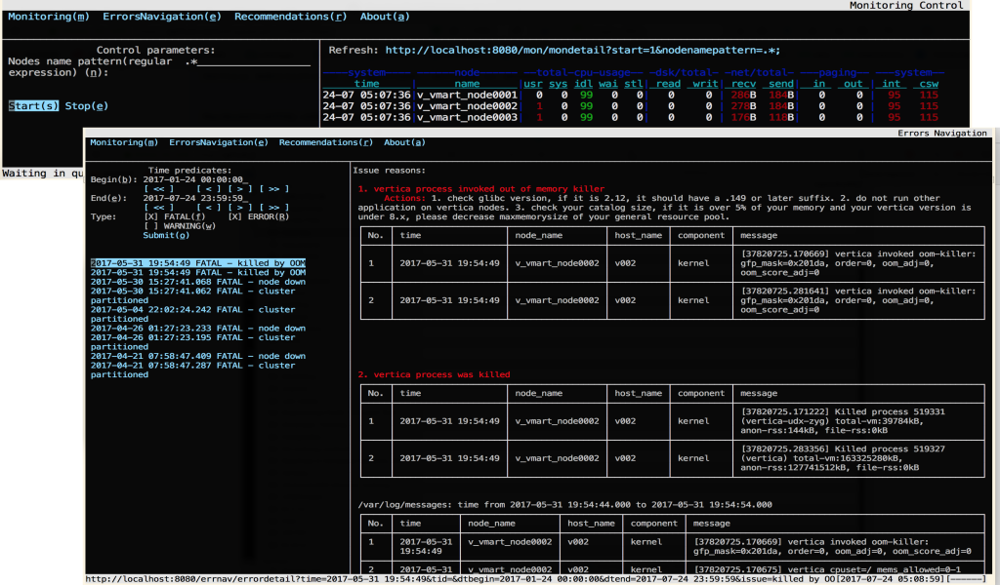

When managing or trouble shooting on Vertica cluster, sometimes you may meet following pain points:

 * when Vertica database is very busy or can not startup immediately, you know nothing about it except reading log files.
 * exploring vertica.log/dbLog/message.log on all Vertica cluster nodes is very boring. 
 * ...

We need tools to make life of Vertica DBA easier, then vDBAHelper come. 

vDBAHelper is a toolkit for Vertica DBA, built on dynamic language **[Python](https://www.python.org/)**  and other open source projects, such as SQLite wrap **[APSW](https://rogerbinns.github.io/apsw/)** for query engine, lightweight distributed process framework **[execnet](http://codespeak.net/execnet/)** for distrubted process, lightweight micro web-framework **[Bottle](https://bottlepy.org/docs/dev/)** for user interface, and text mode web browser **[ELinks](http://elinks.or.cz/)** as client.

vDBAHelper consolidates Vertica log files on all nodes with timeline or session/transaction, including datacollectors, vertica.log, dbLog, message.log etc, provides SQL and TUI interface to show recent issues, guide DBA navigating performance or function issues info, and related suggestions.  

vDBAHelper keeps independent with Vertica and guarantee to be accessible, no matter the status of Vertica database.

Architecture
=============
 1. Text Mode Browser
    - provide lightweight & easy-to-use interface for terminal user
    - but serviced by web
 2. Web Framework
    - knowledge blend in web flow
    - translate actions to SQL
 3. Light SQL engine
    - provide SQL analytic interface
 4. Distributed Process Framework
    - send python code to each Vertica ndoe
    - fetch and filter data on “time” or “node_name”

Features
=============

vDBAHelper has no dependence on Vertica database and clients, it send dynamic code on each Vertica node to parse log files.

APSW/SQLite extensions:
----------
 1. SQL standard support by APSW/SQLite, with query shell and Python API.
 2. virtual tables(external table) for Vertica datacollector files on all Vertica cluster nodes. 
     - push predicates on "time" and/or "node_name" columns to scan for better performance
	 - sync datacollector data to SQLite native table for better performance when not busy, and query offline.
 3. virtual table **vertica_log** for file **vertica.log** on all Vertica cluster nodes.
 4. virtual table **dblog** for file dbLog on all Vertica cluster nodes.
 5. virtual table **messages** for **/var/messages.log** on all Vertica cluster nodes. 
     - Note: You should give access right of **/var/log/messages.log** on all Vertica nodes to user dbadmin first.
 6. automatically execute new configuration table scripts in **./etc/${tablename}.sql** . 

User interfaces through Elinks/Bottle:
----------
 1. Errors Navigation: navigate issues according to rules.
     - identify issue according to rules in configuration tables **log_message_level**, **issue_category**, **issue_reason**.
     - TODO: suggest actions for issue.
 2. TODO: Recommendations: analysis workload, resource usage etc., give tuning recommendations.

Requirements
=============

Python: 2.7+
----------
 - **Note:** **/opt/vertica/oss/python/bin/python** is default used if it exists. 
 1. Python 2.7.10 on RHEL6.5/RHEL7.1 tested
 2. Python 2.7.12 on macOS Sierra 10.12.2 tested

FAQs
=============

How to use it?
----------
vDBAHelper is automatic bootstrapping, no manual remote installation required. 
Just clone or download this project to one of your Vertica nodes, and run following tools immediately:

 - **bin/vDBAHelper.sh** : terminal user interface
      <code><pre>
      MacBookProOfDQ:vDBAHelper liudq$ bin/vDBAHelper.sh --help
      Usage: server.py [options]
      Options:
        -h, --help            show this help message and exit
        -d VDBNAME, --database=VDBNAME
                              Vertica database name, default is the first database
                              in meta file(/opt/vertica/config/admintools.conf)
        -f VMETAFILE, --file=VMETAFILE
                              Vertica database meta file, default is
                              /opt/vertica/config/admintools.conf
        -u VADMINOSUSER, --user=VADMINOSUSER
                              Vertica Administrator OS username, default is dbadmin
      
      MacBookProOfDQ:vDBAHelper liudq$ bin/vDBAHelper.sh </pre></code>
      

 - **bin/sqlite.sh** : SQLite query shell
      <code><pre>
      MacBookProOfDQ:vDBAHelper liudq$ bin/sqlite.sh --help
      Usage: program [OPTIONS] FILENAME [SQL|CMD] [SQL|CMD]...
      FILENAME is the name of a SQLite database. A new database is
      created if the file does not exist.
      OPTIONS include:
         -init filename       read/process named file
         -echo                print commands before execution
         -[no]header          turn headers on or off
         -bail                stop after hitting an error
         -interactive         force interactive I/O
         -batch               force batch I/O
         -column              set output mode to 'column'
         -csv                 set output mode to 'csv'
         -html                set output mode to 'html'
         -line                set output mode to 'line'
         -list                set output mode to 'list'
         -python              set output mode to 'python'
         -separator 'x'       set output field separator (|)
         -nullvalue 'text'    set text string for NULL values
         -version             show SQLite version
         -encoding 'name'     the encoding to use for files
                              opened via .import, .read & .output
         -nocolour            disables colour output to screen
      Vertica OPTIONS:
         -d | --database verticaDBName   Vertica database name, default is the first database in meta file(/opt/vertica/config/admintools.conf)
         -f | --file verticaMetaFile     Vertica database meta file, default is (/opt/vertica/config/admintools.conf)
         -u | --user verticaAdminOSUser  Vertica Administrator OS username, default is dbadmin
         ------------------------
         -h | --help                     show usage
      Notes: you should confirm ssh password-less accessible those nodes IPs in Vertica database meta file with verticaAdminOSUser
      MacBookProOfDQ:vDBAHelper liudq$ bin/sqlite.sh --header 
      Welcome to vDBAHelper!
      Powered by SQLite version 3.16.2 (APSW 3.16.2-r1)
      Enter ".help" for instructions
      Enter SQL statements terminated with a ";"
      sqlite> .tables
      dc_allocation_pool_statistics
      dc_allocation_pool_statistics_by_day
      dc_allocation_pool_statistics_by_hour
      dc_allocation_pool_statistics_by_minute
      dc_allocation_pool_statistics_by_second
      dc_analyze_statistics
      ...
      sqlite> select name from v_internal.sqlite_master order by 1;
      name
      dc_allocation_pool_statistics
      dc_allocation_pool_statistics_by_day
      dc_allocation_pool_statistics_by_hour
      dc_allocation_pool_statistics_by_minute
      dc_allocation_pool_statistics_by_second
      dc_analyze_statistics
      dc_backups
      dc_block_memory_manager_events
      dc_block_memory_manager_statistics
      ...
      sqlite> select * from dc_requests_issued order by time desc limit 1;
      time|node_name|session_id|user_id|user_name|transaction_id|statement_id|request_id|request_type|label|client_label|search_path|query_start_epoch|request|is_retry
      2017-02-01 14:16:57.685396|v_vmart_node0002|v_vmart_node0002-1564:0xac4d|45035996273704962|dbadmin|49539595901079320|1|1|QUERY|||"$user", public, v_catalog, v_monitor, v_internal|1427|select * from dc_requests_issued;|0
      sqlite> .mode line
      sqlite> select * from dc_requests_issued order by time desc limit 1;
                   time = 2017-02-01 14:16:57.685396
              node_name = v_vmart_node0002
             session_id = v_vmart_node0002-1564:0xac4d
                user_id = 45035996273704962
              user_name = dbadmin
         transaction_id = 49539595901079320
           statement_id = 1
             request_id = 1
           request_type = QUERY
                  label = 
           client_label = 
            search_path = "$user", public, v_catalog, v_monitor, v_internal
      query_start_epoch = 1427
                request = select * from dc_requests_issued;
               is_retry = 0
      sqlite> select user_name, count(1), min(time), max(time) from dc_requests_issued group by 1;
      user_name|count(1)|min(time)|max(time)
      dbadmin|104|2016-11-27 17:36:32.291440|2017-02-01 14:16:57.685396 </pre></code>
	  
**Note**: if you want run vDBAHelper out of Vertica cluster nodes, such as on Mac or other linux box, you'd have a Vertica database meta file copy, replace IP of each nodes with accessible addresse, and put it in [/opt/vertica/config/admintools.conf] or attach its location to [-f | --file ] option of upper toos.

Why hotkey can not work on macOS terminal?
----------
vDBAHelper uses Elinks as HTML user interface. Elinks need Alt-Key to trigger accesskey in HTML.

But terminal of macOS will generate special character for Alt-Key by default. To let it work for Elinkks, you shold goto "Terminal > Preferences > Settings > Keyboard", and check ‘Use option as meta key’ at the bottom.

Xterm has similar issue. You should run "echo 'XTerm*metaSendsEscape: true' >> ~/.Xresources" and restart your xterm.

Note, hotkey/accesskey in Elinks is case sensitive, eg. you should press "ALt-Shift-A" for accesskey='A'. 

How to enable arrow keys, Ctrl-A/Ctrl-E/Esc-B/Esc-F and other shortcuts to explore history commands or edit in bin/sqlite.sh cli?
----------
Python/APSW shell uses python readline module to process key press events. You can use "pip show readline" to confirm whether this module has been installed in your python environment.

Sometimes you need run "pip3 uinstall readline" and run "easy_install readline" to fix wired problem.

ImportError: libpython2.6.so.1.0: cannot open shared object file: No such file or directory?
----------
As [eggs/apsw.so.Linux] was built on Python 2.6, it need dynamically link with libpython2.6.so.1.0 . This message means vDBAHelper can not find [libpython\*.so.1.0] under [/usr/lib\*/] . Maybe you'd check where file [libpython\*.so.1.0] locate, then run "ln -s ${PYTHONLIBPATH}/libpython\*.so.1.0 ./lib/libpython2.6.so.1.0" under $vDBAHelper path to link it.

Another approach is rebuilt APSW in your system, install it or copy your new .so to [eggs/apsw.so.Linux]:
  <code><pre>
  \# download apsw source code from "https://rogerbinns.github.io/apsw/download.html#source-and-binaries"
  unzip apsw-3.16.2-r1.zip
  cd apsw-3.16.2-r1
  python setup.py fetch --all build --enable-all-extensions </pre></code>

IOError: [Errno 13] Permission denied: '/var/log/messages'
----------
If you get this error when query on **messages** table, the most possible reason is user dbadmin do not have access right for file **/var/log/messages.log** on some nodes. Please run following command on each Vertica node:
  <code><pre>
  sudo chmod a+r /var/log/messages </pre></code>

How to improve query performance on virtual tables for Vertica?
----------
As data files of virtual tables for Vertica are text based log files on all Vertica cluster nodes, most of time will be spent on parsing text when query.
SQLite will filter multiple times on virtual table if there are "in/or" predicates. 

The best practice is creating a temp/stage table and querying on it. 

Actually in this project, if you provide SQLite db file parameter for upper tools, you are recommended to access **[main.]dc\_\*** tables, they are real SQLite table, data of them are syncronized from **v_internal.dc\_\*** virtual tables for Vertica when SQLite is not busy.

About "time" column format in datacollectors
----------
Type of "time" column in Vertica datacollector tables is TIMESTAMP WITH TIME ZONE. 
SQLite support it but do not have native **TIME ZONE** type storage, it alway use UTC. But "time" value of datacollector tables in SQLite show the same number as Vertia's.
So you need NOT use "datetime(time, 'localtime')" function get correct format at your time zone.

